  

 

<table width="100%"><tr>
<td width="38%" valign="top">

## Chris

遇到问题就写个工具。 
数据不出本机，最后一步人来确认。

 

— 结果比演示重要 
— 先想清楚，再自动化 
— 够用、好懂、方便接手

 

**现在在折腾**

▸ 本地 Agent 工具链 
▸ AI Skill 工程化 
▸ 给企业搭 AI 系统

</td>
<td width="62%" valign="top">

### 做过的东西

**🤖 [Agent Hub](https://github.com/onlyforchris/agent-hub)** 
本地跑企业 Agent，接 MCP 协议 
Python + SQLite

 

**💰 [财小盒](https://github.com/onlyforchris/caixiaohe)** 
Windows 桌面财务工具，拍票、查重、归档 
数据不出本机

 

**🧾 [发票查重](https://github.com/onlyforchris/local-invoice-guardian)** 
本地发票内容查重 + 费用分类 
AI OCR · 两级分类

 

**📋 [JD 简历匹配](https://github.com/onlyforchris/match-resumes-to-jd)** 
从 JD 建画像，持续筛简历 
AI Skill

 

**📮 [公众号发布](https://github.com/onlyforchris/wechat-draft-publisher-skill)** 
Markdown 转公众号草稿发布 
最后一步人工确认

 

另外用 HTML 做了套 [Apple 风格演示模板](https://github.com/onlyforchris/html-ppt-apple-style)，能全屏放映、自动播放，也做成了 Skill 可以一键生成。

### 最近写的

[Blog](https://github.com/onlyforchris/blog) — 只写真实工程问题，不写工具清单和概念拼盘。

· [为什么 200 OK 不等于事情做完了](https://onlyforchris.github.io/blog/why-200-ok-is-not-done/) 
· [一个中文任务名引发的跨平台故障](https://onlyforchris.github.io/blog/chinese-task-name-transport-failure/) 
· [自动化应该在哪一步停下来让人确认](https://onlyforchris.github.io/blog/where-to-stop-and-ask-confirmation/)

其他在做的事

 

DSH — 给企业搭的 AI 招聘系统，9 个聊天渠道接 DeepSeek Harness，IM 路由和定时调度都是真实跑着的 Agent。代码没开源，但 bug 都是真的修了。

</td>
</tr></table>

---

  慢慢做，持续更新。

